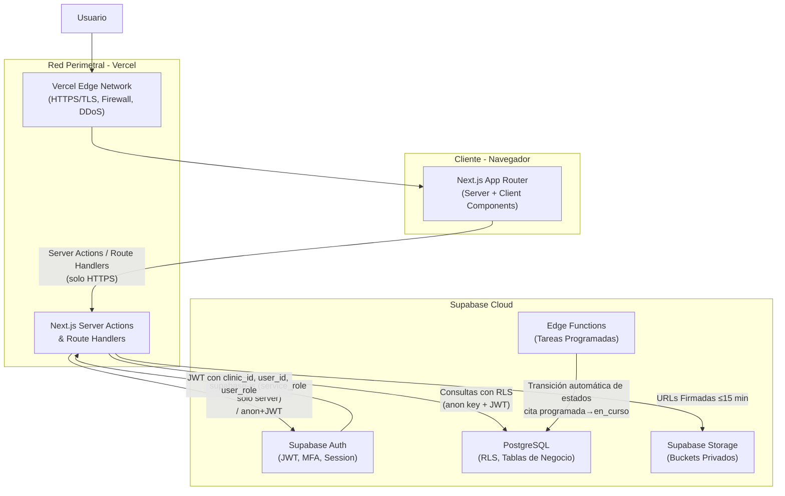
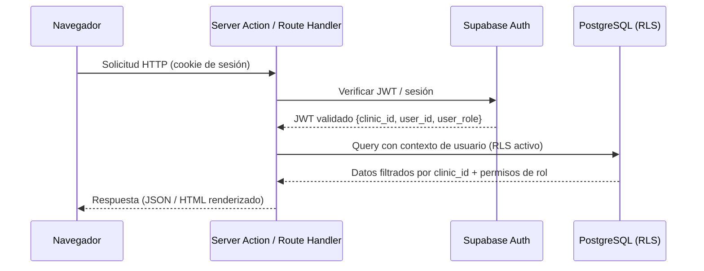
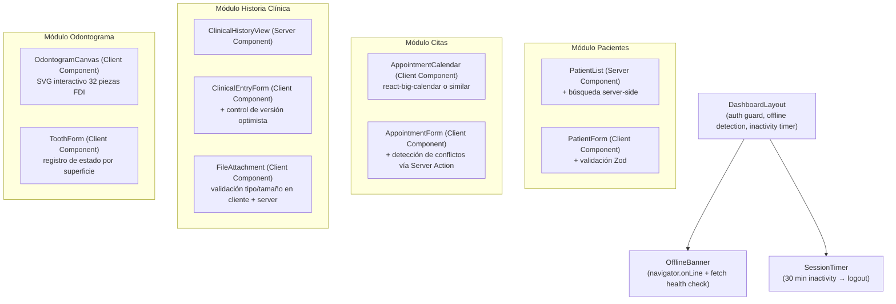
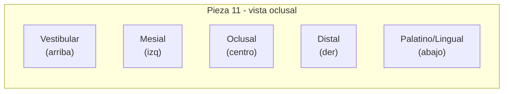
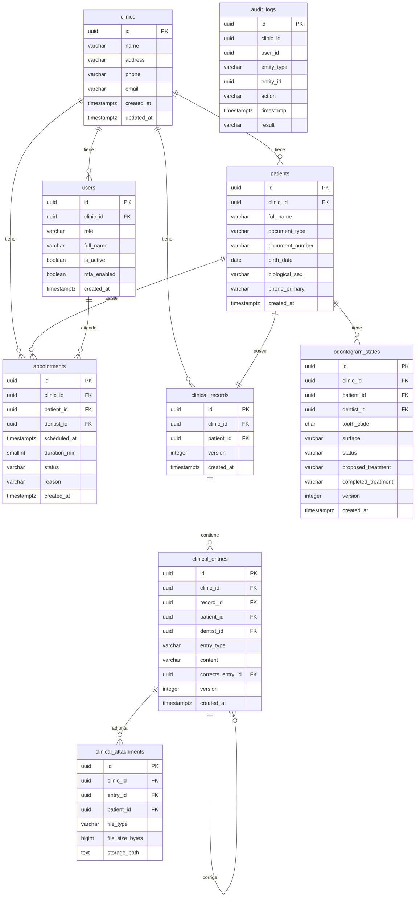
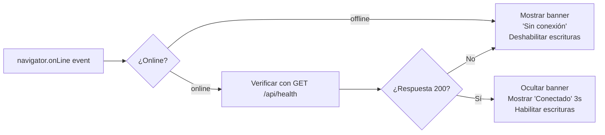
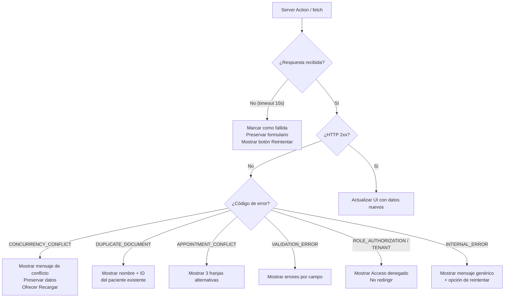

# Documento de Diseño Técnico: Dental Clinic SaaS

## Overview

### Propósito del Sistema

Dental Clinic SaaS es una plataforma web multiempresa (multi-tenant) para la gestión integral de consultorios odontológicos privados en Cúcuta, Colombia. La plataforma centraliza la información operativa y clínica de múltiples consultorios bajo una arquitectura SaaS, garantizando el aislamiento completo de datos entre organizaciones mediante multitenencia lógica basada en `clinic_id`.

### Principios de Diseño

- **Seguridad como capa base**: RLS en base de datos, no solo en lógica de aplicación.
- **Inmutabilidad de registros clínicos**: Las Entradas_Clínicas nunca se modifican; las correcciones crean nuevas entradas.
- **Online-first estricto**: No se persisten datos clínicos en el cliente; las escrituras requieren respuesta exitosa del servidor.
- **Principio de menor privilegio**: Cada rol accede únicamente a las funciones y datos que le corresponden.
- **Trazabilidad total**: Toda operación de escritura sobre entidades de negocio genera un Registro_Auditoria inmutable.

---

## Architecture

### Diagrama de Componentes



### Diagrama de Flujo de Solicitud



### Decisiones de Arquitectura Clave

| Decisión | Elección | Justificación |
|---|---|---|
| Operaciones sensibles | Server Actions / Route Handlers | `service_role_key` nunca en el cliente |
| Multitenencia | Lógica (clinic_id en todas las tablas) | Simpler que multitenencia por esquema; suficiente para el MVP |
| Inmutabilidad clínica | RLS + trigger de BD | No depende solo de la lógica de aplicación |
| Concurrencia optimista | Campo `version` en registros clínicos | Previene escrituras conflictivas sin bloqueos pesimistas |
| Conectividad | Online-first estricto | Sin Service Worker de escritura; datos clínicos nunca en localStorage |

---

## Estructura de Rutas (Next.js App Router)

```
app/
├── layout.tsx                          # Layout raíz (headers de seguridad, fuentes)
├── page.tsx                            # Landing / redirección al login
│
├── (auth)/                             # Grupo sin layout de dashboard
│   ├── login/
│   │   └── page.tsx                    # Inicio de sesión
│   ├── setup-mfa/
│   │   └── page.tsx                    # Configuración MFA obligatoria (admin, odontólogo)
│   └── verify-mfa/
│       └── page.tsx                    # Verificación MFA en cada inicio de sesión
│
├── (dashboard)/                        # Grupo con layout de dashboard (requiere sesión válida)
│   ├── layout.tsx                      # Sidebar, navbar, detector de inactividad (30 min), offline banner
│   │
│   ├── dashboard/
│   │   └── page.tsx                    # Resumen operativo del consultorio
│   │
│   ├── clinica/
│   │   └── configuracion/
│   │       └── page.tsx                # Configuración del consultorio (admin)
│   │
│   ├── usuarios/
│   │   ├── page.tsx                    # Lista de usuarios (admin)
│   │   ├── nuevo/
│   │   │   └── page.tsx               # Crear usuario (admin)
│   │   └── [userId]/
│   │       └── page.tsx               # Editar / desactivar usuario (admin)
│   │
│   ├── pacientes/
│   │   ├── page.tsx                    # Lista / búsqueda de pacientes
│   │   ├── nuevo/
│   │   │   └── page.tsx               # Registrar paciente
│   │   └── [pacienteId]/
│   │       ├── page.tsx               # Perfil del paciente
│   │       ├── historia-clinica/
│   │       │   └── page.tsx           # Historia clínica (odontólogo, admin)
│   │       └── odontograma/
│   │           └── page.tsx           # Odontograma digital (odontólogo, admin)
│   │
│   ├── citas/
│   │   ├── page.tsx                    # Calendario de citas
│   │   ├── nueva/
│   │   │   └── page.tsx               # Crear cita
│   │   └── [citaId]/
│   │       └── page.tsx               # Detalle / reprogramar / cancelar cita
│   │
│   └── reportes/
│       ├── pacientes-atendidos/
│       │   └── page.tsx               # Reporte pacientes atendidos (admin, odontólogo)
│       └── estado-citas/
│           └── page.tsx               # Reporte distribución por estado (admin, odontólogo)
│
└── api/                                # Route Handlers para operaciones que requieren streaming
    ├── health/
    │   └── route.ts                    # Health check (verificación de disponibilidad)
    └── storage/
        └── signed-url/
            └── route.ts               # Generación de URL firmada (server-side)
```

### Middleware de Autenticación

```typescript
// middleware.ts (raíz del proyecto)
// Verifica sesión válida en todas las rutas (dashboard)
// Redirige a /login si no hay sesión o está expirada
// Verifica estado MFA para roles admin/odontólogo
// Inyecta clinic_id, user_id y user_role verificados en headers internos
```

---

## Components and Interfaces

### Estructura de Componentes Principales



### Diseño del Odontograma SVG

El componente `OdontogramCanvas` renderiza las 32 piezas dentales del adulto según nomenclatura FDI, distribuidas en cuatro cuadrantes:

```
Cuadrante 1 (superior derecho): 18,17,16,15,14,13,12,11
Cuadrante 2 (superior izquierdo): 21,22,23,24,25,26,27,28
Cuadrante 3 (inferior izquierdo): 31,32,33,34,35,36,37,38  (izq→der en SVG)
Cuadrante 4 (inferior derecho): 41,42,43,44,45,46,47,48   (der→izq en SVG invertido)
```

Cada pieza dental se representa como un grupo SVG (`<g>`) con:
- Un polígono/rectángulo exterior (vista oclusal con 5 superficies visibles)
- Cinco zonas de superficie clicables: `oclusal` (centro), `mesial` (izquierda), `distal` (derecha), `vestibular` (arriba), `palatino_lingual` (abajo)
- Un indicador de texto con el código FDI de dos dígitos
- Color de relleno por superficie según el estado vigente (paleta de colores por estado)



**Estados predefinidos y su color sugerido:**

| Estado | Color |
|---|---|
| `sano` | Blanco (#FFFFFF) |
| `caries` | Rojo (#FF4444) |
| `obturado` | Azul (#4444FF) |
| `ausente` | Gris cruzado (#CCCCCC) |
| `corona` | Amarillo (#FFD700) |
| `endodoncia` | Naranja (#FF8C00) |
| `extraccion_indicada` | Rojo oscuro (#8B0000) |
| `fractura` | Púrpura (#800080) |

**Interacción:**
1. Clic en superficie → abre `ToothForm` modal/panel lateral con `pieza_id` y `superficie` pre-cargados.
2. `ToothForm` envía vía Server Action con campo `version` para control de concurrencia.
3. Al recibir respuesta exitosa, el componente actualiza el estado local React sin recarga de página.

### Interfaces TypeScript Principales

```typescript
// types/domain.ts

export type UserRole = 'administrador' | 'odontologo' | 'recepcionista';

export type AppointmentStatus =
  | 'programada' | 'confirmada' | 'en_curso'
  | 'completada' | 'cancelada' | 'reprogramada';

export type ClinicalEntryType =
  | 'motivo_consulta' | 'diagnostico' | 'plan_tratamiento'
  | 'procedimiento' | 'evolucion' | 'correccion';

export type ToothSurface =
  | 'oclusal' | 'mesial' | 'distal' | 'vestibular' | 'palatino_lingual' | 'completa';

export type ToothStatus =
  | 'sano' | 'caries' | 'obturado' | 'ausente' | 'corona'
  | 'endodoncia' | 'extraccion_indicada' | 'fractura'
  | string; // estados personalizados del consultorio

export type AuditAction =
  | 'create' | 'update' | 'cancel' | 'reschedule'
  | 'correccion' | 'delete_attempt' | 'access_denied';

export interface JWTClaims {
  clinic_id: string;   // UUID del consultorio
  user_id: string;     // UUID del usuario
  user_role: UserRole; // rol de negocio; `role` está reservado por Supabase
}

export interface AuditRecord {
  id: string;
  clinic_id: string;
  user_id: string;
  role: UserRole;
  entity_type: 'consultorio' | 'usuario' | 'paciente' | 'cita' | 'historia_clinica' | 'odontograma';
  entity_id: string;
  action: AuditAction;
  timestamp: string;  // ISO 8601
  result: 'success' | 'failure';
}
```

### Estrategia Server Actions vs Route Handlers

| Operación | Mecanismo | Justificación |
|---|---|---|
| CRUD de pacientes | Server Action | Formularios React, respuesta directa al componente |
| CRUD de citas | Server Action | Detección de conflictos inline en el servidor |
| Registrar Entrada_Clínica | Server Action | Control de versión + auditoría en una transacción |
| Actualizar pieza odontograma | Server Action | Control de versión optimista |
| Verificar disponibilidad del servidor | Route Handler (`GET /api/health`) | Llamado desde cliente para detectar conectividad |
| Generar URL firmada de Storage | Route Handler (`POST /api/storage/signed-url`) | Requiere `service_role_key`, no exponer en Server Action genérica |
| Reportes | Server Action | Datos del servidor, renderizado en Server Component |
| Transición automática de citas | Supabase Edge Function (cron) | Proceso del servidor, independiente del cliente |

**Regla fundamental**: `service_role_key` solo se instancia en Server Actions, Route Handlers y Edge Functions. El cliente recibe únicamente el `anon key` de Supabase y opera con JWT del usuario (RLS activo).

---

## Data Models

### Esquema PostgreSQL Completo

#### Tabla: `clinics` (Consultorios)

```sql
CREATE TABLE clinics (
  id            UUID PRIMARY KEY DEFAULT gen_random_uuid(),
  name          VARCHAR(120)  NOT NULL CHECK (char_length(name) BETWEEN 1 AND 120),
  address       VARCHAR(255),
  phone         VARCHAR(15)   CHECK (phone ~ '^[0-9]{7,15}$'),
  email         VARCHAR(254)  CHECK (email ~* '^[^@]+@[^@]+\.[^@]+$'),
  created_at    TIMESTAMPTZ   NOT NULL DEFAULT now(),
  updated_at    TIMESTAMPTZ   NOT NULL DEFAULT now()
);

-- Trigger para updated_at automático
CREATE TRIGGER set_clinics_updated_at
  BEFORE UPDATE ON clinics
  FOR EACH ROW EXECUTE FUNCTION update_updated_at_column();
```

#### Tabla: `users` (Usuarios)

```sql
-- Extiende auth.users de Supabase
CREATE TABLE users (
  id            UUID PRIMARY KEY REFERENCES auth.users(id) ON DELETE CASCADE,
  clinic_id     UUID          NOT NULL REFERENCES clinics(id),
  role          VARCHAR(20)   NOT NULL CHECK (role IN ('administrador', 'odontologo', 'recepcionista')),
  full_name     VARCHAR(200)  NOT NULL,
  is_active     BOOLEAN       NOT NULL DEFAULT true,
  mfa_enabled   BOOLEAN       NOT NULL DEFAULT false,
  created_at    TIMESTAMPTZ   NOT NULL DEFAULT now(),
  updated_at    TIMESTAMPTZ   NOT NULL DEFAULT now()
);

CREATE INDEX idx_users_clinic_id ON users(clinic_id);
CREATE INDEX idx_users_clinic_role ON users(clinic_id, role);
```

#### Tabla: `patients` (Pacientes)

```sql
CREATE TABLE patients (
  id                UUID        PRIMARY KEY DEFAULT gen_random_uuid(),
  clinic_id         UUID        NOT NULL REFERENCES clinics(id),
  full_name         VARCHAR(200) NOT NULL CHECK (char_length(full_name) BETWEEN 1 AND 200),
  document_type     VARCHAR(20)  NOT NULL CHECK (document_type IN ('CC', 'TI', 'CE', 'PA', 'RC', 'NIT')),
  document_number   VARCHAR(20)  NOT NULL CHECK (document_number ~ '^[A-Za-z0-9]{1,20}$'),
  birth_date        DATE         NOT NULL CHECK (birth_date <= CURRENT_DATE),
  biological_sex    VARCHAR(10)  NOT NULL CHECK (biological_sex IN ('masculino', 'femenino', 'intersexual')),
  phone_primary     VARCHAR(15)  NOT NULL CHECK (phone_primary ~ '^[0-9]{7,15}$'),
  email             VARCHAR(254) CHECK (email ~* '^[^@]+@[^@]+\.[^@]+$'),
  address           VARCHAR(255),
  guardian_name     VARCHAR(200),
  guardian_phone    VARCHAR(15)  CHECK (guardian_phone ~ '^[0-9]{7,15}$'),
  medical_history   VARCHAR(500),
  created_at        TIMESTAMPTZ  NOT NULL DEFAULT now(),
  updated_at        TIMESTAMPTZ  NOT NULL DEFAULT now(),

  UNIQUE (clinic_id, document_type, document_number)
);

CREATE INDEX idx_patients_clinic_id ON patients(clinic_id);
CREATE INDEX idx_patients_search ON patients
  USING GIN (to_tsvector('spanish', full_name || ' ' || document_number));
CREATE INDEX idx_patients_document ON patients(clinic_id, document_type, document_number);
```

#### Tabla: `appointments` (Citas)

```sql
CREATE TABLE appointments (
  id              UUID          PRIMARY KEY DEFAULT gen_random_uuid(),
  clinic_id       UUID          NOT NULL REFERENCES clinics(id),
  patient_id      UUID          NOT NULL REFERENCES patients(id),
  dentist_id      UUID          NOT NULL REFERENCES users(id),
  scheduled_at    TIMESTAMPTZ   NOT NULL CHECK (scheduled_at >= now() - interval '1 second'),
  duration_min    SMALLINT      NOT NULL CHECK (duration_min BETWEEN 15 AND 480),
  ends_at         TIMESTAMPTZ   GENERATED ALWAYS AS (scheduled_at + (duration_min * interval '1 minute')) STORED,
  status          VARCHAR(20)   NOT NULL DEFAULT 'programada'
                  CHECK (status IN ('programada','confirmada','en_curso','completada','cancelada','reprogramada')),
  reason          VARCHAR(500)  NOT NULL,
  cancel_reason   VARCHAR(255),
  cancelled_by    UUID          REFERENCES users(id),
  cancelled_at    TIMESTAMPTZ,
  rescheduled_from UUID         REFERENCES appointments(id),
  created_by      UUID          NOT NULL REFERENCES users(id),
  created_at      TIMESTAMPTZ   NOT NULL DEFAULT now(),
  updated_at      TIMESTAMPTZ   NOT NULL DEFAULT now()
);

CREATE INDEX idx_appointments_clinic_id ON appointments(clinic_id);
CREATE INDEX idx_appointments_dentist_date ON appointments(clinic_id, dentist_id, scheduled_at);
CREATE INDEX idx_appointments_patient ON appointments(clinic_id, patient_id);
CREATE INDEX idx_appointments_status ON appointments(clinic_id, status);

-- Exclusion constraint para prevenir solapamiento de citas del mismo odontólogo
-- Requiere extensión btree_gist
CREATE EXTENSION IF NOT EXISTS btree_gist;
ALTER TABLE appointments ADD CONSTRAINT no_overlap_appointments
  EXCLUDE USING gist (
    dentist_id WITH =,
    tstzrange(scheduled_at, ends_at, '[)') WITH &&
  )
  WHERE (status IN ('programada','confirmada','en_curso'));
```

#### Tabla: `clinical_records` (Historias Clínicas — cabecera)

```sql
CREATE TABLE clinical_records (
  id          UUID        PRIMARY KEY DEFAULT gen_random_uuid(),
  clinic_id   UUID        NOT NULL REFERENCES clinics(id),
  patient_id  UUID        NOT NULL REFERENCES patients(id),
  version     INTEGER     NOT NULL DEFAULT 1,
  created_at  TIMESTAMPTZ NOT NULL DEFAULT now(),
  updated_at  TIMESTAMPTZ NOT NULL DEFAULT now(),

  UNIQUE (clinic_id, patient_id)
);

CREATE INDEX idx_clinical_records_clinic_patient ON clinical_records(clinic_id, patient_id);
```

#### Tabla: `clinical_entries` (Entradas Clínicas — inmutables)

```sql
CREATE TABLE clinical_entries (
  id              UUID           PRIMARY KEY DEFAULT gen_random_uuid(),
  clinic_id       UUID           NOT NULL REFERENCES clinics(id),
  record_id       UUID           NOT NULL REFERENCES clinical_records(id),
  patient_id      UUID           NOT NULL REFERENCES patients(id),
  dentist_id      UUID           NOT NULL REFERENCES users(id),
  entry_type      VARCHAR(30)    NOT NULL
                  CHECK (entry_type IN ('motivo_consulta','diagnostico','plan_tratamiento',
                                        'procedimiento','evolucion','correccion')),
  content         VARCHAR(5000)  NOT NULL CHECK (char_length(content) BETWEEN 1 AND 5000),
  corrects_entry_id UUID         REFERENCES clinical_entries(id),  -- solo para tipo 'correccion'
  version         INTEGER        NOT NULL DEFAULT 1,
  created_at      TIMESTAMPTZ    NOT NULL DEFAULT now()

  -- SIN updated_at intencionalmente: inmutable por diseño
);

-- Restricción: solo entradas de tipo 'correccion' pueden tener corrects_entry_id
ALTER TABLE clinical_entries ADD CONSTRAINT correction_entry_consistency
  CHECK (
    (entry_type = 'correccion' AND corrects_entry_id IS NOT NULL)
    OR
    (entry_type <> 'correccion' AND corrects_entry_id IS NULL)
  );

CREATE INDEX idx_clinical_entries_record ON clinical_entries(record_id, created_at);
CREATE INDEX idx_clinical_entries_clinic_patient ON clinical_entries(clinic_id, patient_id);
```

#### Tabla: `clinical_attachments` (Adjuntos de Entradas Clínicas)

```sql
CREATE TABLE clinical_attachments (
  id              UUID          PRIMARY KEY DEFAULT gen_random_uuid(),
  clinic_id       UUID          NOT NULL REFERENCES clinics(id),
  entry_id        UUID          NOT NULL REFERENCES clinical_entries(id),
  patient_id      UUID          NOT NULL REFERENCES patients(id),
  file_name       VARCHAR(255)  NOT NULL,
  file_type       VARCHAR(10)   NOT NULL CHECK (file_type IN ('JPEG','PNG','PDF','DICOM')),
  file_size_bytes BIGINT        NOT NULL CHECK (file_size_bytes BETWEEN 1 AND 20971520), -- 20 MB
  storage_path    TEXT          NOT NULL,  -- path en Supabase Storage
  created_at      TIMESTAMPTZ   NOT NULL DEFAULT now()
);

-- Restricción: máximo 10 adjuntos por entrada clínica
-- Validada en Server Action antes de INSERT

CREATE INDEX idx_clinical_attachments_entry ON clinical_attachments(entry_id);
CREATE INDEX idx_clinical_attachments_clinic_patient ON clinical_attachments(clinic_id, patient_id);
```

#### Tabla: `odontogram_states` (Estados del Odontograma)

```sql
CREATE TABLE odontogram_states (
  id                    UUID          PRIMARY KEY DEFAULT gen_random_uuid(),
  clinic_id             UUID          NOT NULL REFERENCES clinics(id),
  patient_id            UUID          NOT NULL REFERENCES patients(id),
  dentist_id            UUID          NOT NULL REFERENCES users(id),
  tooth_code            CHAR(2)       NOT NULL
                        CHECK (tooth_code IN (
                          '11','12','13','14','15','16','17','18',
                          '21','22','23','24','25','26','27','28',
                          '31','32','33','34','35','36','37','38',
                          '41','42','43','44','45','46','47','48'
                        )),
  surface               VARCHAR(20)   NOT NULL
                        CHECK (surface IN ('oclusal','mesial','distal','vestibular','palatino_lingual','completa')),
  status                VARCHAR(50)   NOT NULL,  -- predefinido o personalizado del consultorio
  proposed_treatment    VARCHAR(500),
  completed_treatment   VARCHAR(500),
  version               INTEGER       NOT NULL DEFAULT 1,
  created_at            TIMESTAMPTZ   NOT NULL DEFAULT now()

  -- Inmutable: sin updated_at. Cada cambio genera un nuevo registro.
);

CREATE INDEX idx_odontogram_clinic_patient ON odontogram_states(clinic_id, patient_id);
CREATE INDEX idx_odontogram_latest ON odontogram_states(clinic_id, patient_id, tooth_code, surface, created_at DESC);
```

#### Tabla: `custom_tooth_statuses` (Estados Personalizados del Odontograma)

```sql
CREATE TABLE custom_tooth_statuses (
  id          UUID         PRIMARY KEY DEFAULT gen_random_uuid(),
  clinic_id   UUID         NOT NULL REFERENCES clinics(id),
  name        VARCHAR(50)  NOT NULL CHECK (char_length(name) BETWEEN 1 AND 50),
  color_hex   CHAR(7)      CHECK (color_hex ~ '^#[0-9A-Fa-f]{6}$'),
  created_at  TIMESTAMPTZ  NOT NULL DEFAULT now(),

  UNIQUE (clinic_id, name)
);

-- Restricción: máximo 20 estados personalizados por consultorio (validada en Server Action)

CREATE INDEX idx_custom_statuses_clinic ON custom_tooth_statuses(clinic_id);
```

#### Tabla: `audit_logs` (Registros de Auditoría — inmutables)

```sql
CREATE TABLE audit_logs (
  id           UUID         PRIMARY KEY DEFAULT gen_random_uuid(),
  clinic_id    UUID         NOT NULL,  -- sin FK para preservar si consultorio se elimina
  user_id      UUID         NOT NULL,  -- sin FK para preservar si usuario se elimina
  role         VARCHAR(20)  NOT NULL,
  entity_type  VARCHAR(30)  NOT NULL
               CHECK (entity_type IN ('consultorio','usuario','paciente','cita','historia_clinica','odontograma')),
  entity_id    UUID         NOT NULL,
  action       VARCHAR(20)  NOT NULL,
  timestamp    TIMESTAMPTZ  NOT NULL DEFAULT now(),
  result       VARCHAR(10)  NOT NULL CHECK (result IN ('success','failure')),
  metadata     JSONB        -- información adicional contextual (opcional)

  -- SIN updated_at: inmutable por diseño
);

CREATE INDEX idx_audit_clinic_timestamp ON audit_logs(clinic_id, timestamp DESC);
CREATE INDEX idx_audit_entity ON audit_logs(clinic_id, entity_type, entity_id);
CREATE INDEX idx_audit_user ON audit_logs(clinic_id, user_id);
```

#### Función de Trigger `updated_at`

```sql
CREATE OR REPLACE FUNCTION update_updated_at_column()
RETURNS TRIGGER AS $$
BEGIN
  NEW.updated_at = now();
  RETURN NEW;
END;
$$ LANGUAGE plpgsql;
```

### Diagrama Entidad-Relación



### Políticas RLS

#### `clinics`

```sql
ALTER TABLE clinics ENABLE ROW LEVEL SECURITY;

-- Solo el administrador del consultorio puede ver/editar su propio consultorio
CREATE POLICY "clinics_select_own" ON clinics FOR SELECT
  USING (id = (SELECT clinic_id FROM users WHERE id = auth.uid()));

CREATE POLICY "clinics_update_admin" ON clinics FOR UPDATE
  USING (
    id = (SELECT clinic_id FROM users WHERE id = auth.uid() AND role = 'administrador')
  );
```

#### `users`

```sql
ALTER TABLE users ENABLE ROW LEVEL SECURITY;

CREATE POLICY "users_select_same_clinic" ON users FOR SELECT
  USING (clinic_id = (SELECT clinic_id FROM users WHERE id = auth.uid()));

CREATE POLICY "users_insert_admin" ON users FOR INSERT
  WITH CHECK (
    clinic_id = (SELECT clinic_id FROM users WHERE id = auth.uid() AND role = 'administrador')
  );

CREATE POLICY "users_update_admin" ON users FOR UPDATE
  USING (
    clinic_id = (SELECT clinic_id FROM users WHERE id = auth.uid() AND role = 'administrador')
  );

-- DELETE denegado para todos (se desactiva, no se elimina)
```

#### `patients`

```sql
ALTER TABLE patients ENABLE ROW LEVEL SECURITY;

CREATE POLICY "patients_select_same_clinic" ON patients FOR SELECT
  USING (clinic_id = (SELECT clinic_id FROM users WHERE id = auth.uid()));

CREATE POLICY "patients_insert_authorized" ON patients FOR INSERT
  WITH CHECK (
    clinic_id = (SELECT clinic_id FROM users WHERE id = auth.uid())
    AND (SELECT role FROM users WHERE id = auth.uid()) IN ('administrador','odontologo','recepcionista')
  );

CREATE POLICY "patients_update_authorized" ON patients FOR UPDATE
  USING (
    clinic_id = (SELECT clinic_id FROM users WHERE id = auth.uid())
    AND (SELECT role FROM users WHERE id = auth.uid()) IN ('administrador','odontologo','recepcionista')
  );
```

#### `appointments`

```sql
ALTER TABLE appointments ENABLE ROW LEVEL SECURITY;

CREATE POLICY "appointments_select_same_clinic" ON appointments FOR SELECT
  USING (clinic_id = (SELECT clinic_id FROM users WHERE id = auth.uid()));

CREATE POLICY "appointments_insert_authorized" ON appointments FOR INSERT
  WITH CHECK (
    clinic_id = (SELECT clinic_id FROM users WHERE id = auth.uid())
    AND (SELECT role FROM users WHERE id = auth.uid()) IN ('administrador','odontologo','recepcionista')
  );

CREATE POLICY "appointments_update_authorized" ON appointments FOR UPDATE
  USING (
    clinic_id = (SELECT clinic_id FROM users WHERE id = auth.uid())
    AND (SELECT role FROM users WHERE id = auth.uid()) IN ('administrador','odontologo','recepcionista')
  );
```

#### `clinical_records`

```sql
ALTER TABLE clinical_records ENABLE ROW LEVEL SECURITY;

CREATE POLICY "clinical_records_select_clinical" ON clinical_records FOR SELECT
  USING (
    clinic_id = (SELECT clinic_id FROM users WHERE id = auth.uid())
    AND (SELECT role FROM users WHERE id = auth.uid()) IN ('administrador','odontologo')
  );

CREATE POLICY "clinical_records_insert_dentist" ON clinical_records FOR INSERT
  WITH CHECK (
    clinic_id = (SELECT clinic_id FROM users WHERE id = auth.uid())
    AND (SELECT role FROM users WHERE id = auth.uid()) IN ('administrador','odontologo')
  );

-- UPDATE solo para incrementar version (control de concurrencia)
CREATE POLICY "clinical_records_update_version" ON clinical_records FOR UPDATE
  USING (
    clinic_id = (SELECT clinic_id FROM users WHERE id = auth.uid())
    AND (SELECT role FROM users WHERE id = auth.uid()) IN ('administrador','odontologo')
  );
```

#### `clinical_entries` (inmutables)

```sql
ALTER TABLE clinical_entries ENABLE ROW LEVEL SECURITY;

CREATE POLICY "clinical_entries_select_clinical" ON clinical_entries FOR SELECT
  USING (
    clinic_id = (SELECT clinic_id FROM users WHERE id = auth.uid())
    AND (SELECT role FROM users WHERE id = auth.uid()) IN ('administrador','odontologo')
  );

CREATE POLICY "clinical_entries_insert_dentist" ON clinical_entries FOR INSERT
  WITH CHECK (
    clinic_id = (SELECT clinic_id FROM users WHERE id = auth.uid())
    AND (SELECT role FROM users WHERE id = auth.uid()) IN ('administrador','odontologo')
  );

-- UPDATE y DELETE denegados para todos (inmutabilidad garantizada por RLS)
-- No se crean políticas UPDATE ni DELETE → rechazadas por defecto
```

#### `odontogram_states` (inmutables — append only)

```sql
ALTER TABLE odontogram_states ENABLE ROW LEVEL SECURITY;

CREATE POLICY "odontogram_select_clinical" ON odontogram_states FOR SELECT
  USING (
    clinic_id = (SELECT clinic_id FROM users WHERE id = auth.uid())
    AND (SELECT role FROM users WHERE id = auth.uid()) IN ('administrador','odontologo')
  );

CREATE POLICY "odontogram_insert_dentist" ON odontogram_states FOR INSERT
  WITH CHECK (
    clinic_id = (SELECT clinic_id FROM users WHERE id = auth.uid())
    AND (SELECT role FROM users WHERE id = auth.uid()) IN ('administrador','odontologo')
  );

-- UPDATE y DELETE denegados: el historial es append-only
```

#### `audit_logs` (inmutables)

```sql
ALTER TABLE audit_logs ENABLE ROW LEVEL SECURITY;

-- Solo el administrador puede leer los logs de su consultorio
CREATE POLICY "audit_logs_select_admin" ON audit_logs FOR SELECT
  USING (
    clinic_id = (SELECT clinic_id FROM users WHERE id = auth.uid())
    AND (SELECT role FROM users WHERE id = auth.uid()) = 'administrador'
  );

-- INSERT permitido solo desde el servidor (service_role) vía Server Action
-- UPDATE y DELETE denegados para TODOS (incluido administrador)
```

### Supabase Storage

#### Estructura de Buckets

```
Bucket: clinical-files  (privado, no público)
├── {clinic_id}/
│   └── {patient_id}/
│       └── {entry_id}/
│           ├── {uuid}-radiografia.jpg
│           ├── {uuid}-informe.pdf
│           └── {uuid}-scan.dcm
```

#### Políticas de Storage

```sql
-- Solo odontólogos y administradores del mismo consultorio pueden subir archivos
CREATE POLICY "storage_insert_clinical" ON storage.objects FOR INSERT
  WITH CHECK (
    bucket_id = 'clinical-files'
    AND (storage.foldername(name))[1] = (
      SELECT clinic_id::text FROM users WHERE id = auth.uid()
    )
    AND (SELECT role FROM users WHERE id = auth.uid()) IN ('administrador','odontologo')
  );

-- Solo odontólogos y administradores del mismo consultorio pueden leer archivos
-- El acceso real es vía URL firmada generada server-side
CREATE POLICY "storage_select_clinical" ON storage.objects FOR SELECT
  USING (
    bucket_id = 'clinical-files'
    AND (storage.foldername(name))[1] = (
      SELECT clinic_id::text FROM users WHERE id = auth.uid()
    )
    AND (SELECT role FROM users WHERE id = auth.uid()) IN ('administrador','odontologo')
  );
```

**Generación de URL firmada (server-side únicamente):**
```typescript
// Solo en Route Handler o Server Action — nunca en cliente
const { data } = await supabaseAdmin.storage
  .from('clinical-files')
  .createSignedUrl(storagePath, 900); // 900 segundos = 15 minutos exactos
```

---

## Flujo de Autenticación y Manejo de Sesiones

### Diagrama de Flujo de Autenticación

```mermaid
flowchart TD
    A([Usuario accede]) --> B{¿Sesión válida?}
    B -- No --> C[Pantalla de Login]
    B -- Sí --> D{¿MFA requerido?}
    C --> E[Ingresa email + contraseña]
    E --> F{¿5 intentos fallidos?}
    F -- Sí --> G[Bloqueo 15 min\n+ notificación admin]
    F -- No --> H[Supabase Auth verifica credenciales]
    H --> I{¿Credenciales válidas?}
    I -- No --> F
    I -- Sí --> D
    D -- Sí\nAdmin/Odontólogo --> J{¿MFA configurado?}
    J -- No --> K[Flujo configuración MFA\nTOTP obligatorio]
    K --> L{¿Completó MFA setup?}
    L -- No --> M[Cierre de sesión\nvolver a login]
    L -- Sí --> N[Verificar código TOTP]
    J -- Sí --> N
    N --> O{¿Código válido?}
    O -- No --> M
    O -- Sí --> P[Emitir JWT\n{clinic_id, user_id, user_role}]
    D -- No\nRecepcionista --> P
    P --> Q[Dashboard del consultorio]
```

### Manejo de Inactividad (30 minutos)

El componente `SessionTimer` en el layout del dashboard:

```typescript
// Implementado como Client Component
// Eventos que reinician el timer: click, keydown, mousemove, touchstart
// Al cumplir 30 min sin eventos: llama a supabase.auth.signOut() + redirect('/login')
// Almacena el último timestamp de actividad en memoria React (no en localStorage)
```

### Headers de Seguridad HTTP

Configurados en `next.config.ts` vía `headers()`:

```typescript
const securityHeaders = [
  {
    key: 'Content-Security-Policy',
    value: [
      "default-src 'self'",
      "script-src 'self' 'unsafe-inline'",  // requerido por Next.js
      "style-src 'self' 'unsafe-inline'",
      `connect-src 'self' https://*.supabase.co`,
      "img-src 'self' data: blob:",
      "frame-ancestors 'none'",
    ].join('; '),
  },
  { key: 'Strict-Transport-Security', value: 'max-age=63072000; includeSubDomains; preload' },
  { key: 'X-Content-Type-Options', value: 'nosniff' },
  { key: 'Referrer-Policy', value: 'strict-origin-when-cross-origin' },
];
```

---

## Manejo de Errores y Conectividad

### Clasificación de Errores

| Categoría | Código HTTP | Comportamiento del cliente |
|---|---|---|
| No autenticado | 401 | Redirigir a /login, limpiar sesión |
| No autorizado | 403 | Mostrar "Acceso denegado", no redirigir |
| Conflicto de unicidad (documento paciente) | 409 | Mostrar nombre + ID del paciente existente |
| Conflicto de concurrencia (version mismatch) | 409 | Mostrar mensaje específico, preservar datos del formulario |
| Conflicto de horario (cita) | 409 | Mostrar próximas 3 franjas disponibles |
| Error de validación | 422 | Mostrar errores por campo |
| Error del servidor | 500 | Mostrar mensaje genérico + opción de reintento |
| Timeout (10 seg sin respuesta) | — | Marcar como fallida, preservar formulario |

### Detección de Conectividad



### Control de Concurrencia Optimista

```typescript
// Server Action para guardar Entrada_Clínica
async function saveClinicalEntry(data: ClinicalEntryInput) {
  const supabase = createServerClient();
  
  // 1. Verificar version actual
  const { data: record } = await supabase
    .from('clinical_records')
    .select('version')
    .eq('id', data.record_id)
    .single();
  
  if (record.version !== data.expected_version) {
    return { error: 'CONCURRENCY_CONFLICT', message: 'El registro fue modificado por otro usuario. Recargue y revise.' };
  }
  
  // 2. Insertar entrada + incrementar version en transacción
  // (usando RPC de Supabase o transaction en pg)
}
```

---

## Correctness Properties

*Una propiedad es una característica o comportamiento que debe ser verdadero en todas las ejecuciones válidas de un sistema — esencialmente, una afirmación formal sobre lo que el sistema debe hacer. Las propiedades sirven como puente entre las especificaciones legibles por humanos y las garantías de corrección verificables por máquina.*

### Reflexión de Propiedades (Eliminación de Redundancias)

Antes de definir las propiedades finales, se identificaron y consolidaron las siguientes redundancias del prework:

- **1.4, 2.4, 4.8, 5.11, 7.8, 9.6**: todas son instancias de la propiedad de aislamiento de tenants → **Propiedad 1**
- **1.6, 1.7**: round-trip de datos del consultorio → **Propiedad 2**
- **4.2, 5.3**: validación de campos obligatorios en entidades distintas → **Propiedad 3** (generalizada)
- **4.3, 4.4**: unicidad de documento dentro del consultorio → **Propiedad 4**
- **2.2, 4.1, 6.2, 7.2, 7.9**: completitud de datos al crear entidades → **Propiedad 5** (generalizada como round-trip)
- **4.6, 5.10, 6.6, 8.4**: propiedad universal de auditoría → **Propiedad 6**
- **2.3, 6.9, 7.7, 9.5**: autorización por rol → **Propiedad 7**
- **5.1, 5.4**: no solapamiento de citas (invariante) → **Propiedad 8**
- **5.6**: integridad de datos de cancelación → **Propiedad 9**
- **6.1**: unicidad de Historia_Clínica por paciente → **Propiedad 10**
- **6.3, 8.5**: inmutabilidad de registros clínicos y de auditoría → **Propiedad 11**
- **6.4**: corrección trazada con referencia al original → **Propiedad 12**
- **6.5**: ordenamiento cronológico de historia clínica → **Propiedad 13**
- **6.7**: validación de archivos adjuntos → **Propiedad 14**
- **6.11, 7.6, 10.5**: control de concurrencia optimista → **Propiedad 15**
- **7.3, 7.4**: append-only e historial del odontograma → **Propiedad 16**
- **8.6**: expiración de URLs firmadas → **Propiedad 17**
- **8.8, 10.4, 10.6**: preservación de UI ante fallo del servidor → **Propiedad 18**
- **9.1, 9.2**: corrección de reportes por filtros → **Propiedad 19**
- **9.3**: validación de rango de fechas en reportes → **Propiedad 20**
- **10.2**: round-trip de conectividad (offline → online) → **Propiedad 21**
- **1.8, 3.3**: validación de inputs (consultorio y contraseñas) → **Propiedad 22**
- **2.6**: protección del último administrador activo → **Propiedad 23**
- **2.9**: integridad del JWT emitido → **Propiedad 24**
- **3.7**: headers de seguridad HTTP presentes en todas las respuestas → **Propiedad 25**

---

### Property 1: Aislamiento Completo de Tenants

*Para cualquier* usuario autenticado con `clinic_id = C`, toda consulta SELECT, INSERT, UPDATE o DELETE sobre cualquier tabla de negocio (patients, appointments, clinical_records, clinical_entries, odontogram_states, users, audit_logs) debe retornar únicamente filas cuyo `clinic_id = C`, rechazando cualquier intento de acceder a filas de consultorios distintos.

**Validates: Requirements 1.4, 2.4, 4.8, 5.11, 7.8, 8.1, 9.6**

---

### Property 2: Round-Trip de Datos del Consultorio

*Para cualquier* conjunto de datos válidos de consultorio (nombre ≤120 chars, teléfono de 7-15 dígitos numéricos, email con formato válido, dirección ≤255 chars), escribirlos mediante la operación de actualización y recuperarlos mediante la operación de lectura debe producir exactamente los mismos valores, sin alteración de ningún campo.

**Validates: Requirements 1.6, 1.7**

---

### Property 3: Rechazo de Datos Obligatorios Ausentes o Inválidos

*Para cualquier* intento de registro o creación de una entidad de negocio (consultorio, paciente, cita) que contenga al menos un campo obligatorio ausente, vacío, o con formato inválido, el sistema debe rechazar la operación, indicar específicamente los campos con error, y no persistir ningún dato parcial.

**Validates: Requirements 1.8, 4.2, 5.3**

---

### Property 4: Unicidad de Documento de Paciente por Consultorio

*Para cualquier* consultorio y cualquier paciente ya registrado con un tipo y número de documento, un intento de registrar otro paciente con el mismo par (tipo, número de documento) en el mismo consultorio debe ser rechazado, retornando en el mensaje de error el nombre completo y el identificador del paciente existente.

**Validates: Requirements 4.3, 4.4**

---

### Property 5: Round-Trip de Datos de Entidades Clínicas

*Para cualquier* conjunto de campos válidos de una entidad (paciente, cita, entrada clínica, estado de odontograma) creada mediante la operación de registro, los datos recuperados mediante la operación de lectura deben ser byte a byte idénticos a los enviados, incluyendo `pieza_id`, `superficie`, `estado`, `tratamiento_propuesto`, `tratamiento_realizado`, `odontologo_id`, `clinic_id`, `paciente_id` y `created_at` para el odontograma; y `odontologo_id`, `paciente_id`, `clinic_id`, `entry_type`, `content`, `created_at` e `id` para entradas clínicas.

**Validates: Requirements 4.1, 6.2, 7.2, 7.9**

---

### Property 6: Completitud e Integridad del Registro de Auditoría

*Para cualquier* operación de escritura exitosa o fallida (create, update, cancel, reschedule, correccion) realizada por cualquier usuario sobre cualquier entidad de negocio (consultorio, usuario, paciente, cita, historia_clinica, odontograma), debe existir en `audit_logs` exactamente una entrada que contenga los nueve campos requeridos: `id`, `clinic_id`, `user_id`, `role`, `entity_type`, `entity_id`, `action`, `timestamp` y `result` (`success` o `failure`).

**Validates: Requirements 4.6, 5.10, 6.6, 8.4**

---

### Property 7: Control de Acceso por Rol

*Para cualquier* usuario con rol `recepcionista`, todo intento de realizar operaciones de gestión de usuarios (create/update/deactivate), acceso a entradas clínicas (SELECT/INSERT sobre clinical_entries), modificación del odontograma (INSERT sobre odontogram_states), o acceso a reportes operativos debe ser rechazado con acceso denegado (HTTP 403 o error de RLS), independientemente del consultorio, del paciente o de la entidad específica involucrada. *Para cualquier* usuario con rol `odontologo` o `recepcionista`, todo intento de gestión de usuarios debe ser rechazado.

**Validates: Requirements 2.3, 6.9, 7.7, 9.5**

---

### Property 8: Invariante de No Solapamiento de Citas

*Para cualquier* conjunto de citas activas (estados: `programada`, `confirmada`, `en_curso`) del mismo odontólogo en el mismo consultorio, ningún par de citas debe tener franjas horarias solapadas, es decir, para todo par de citas (A, B): `A.scheduled_at ≥ B.ends_at` OR `B.scheduled_at ≥ A.ends_at`. Esta invariante debe mantenerse tras cualquier operación de creación o reprogramación de citas.

**Validates: Requirements 5.1, 5.4**

---

### Property 9: Integridad de Datos de Cancelación de Citas

*Para cualquier* cita cancelada mediante la operación de cancelación, el registro resultante debe tener exactamente: `status = 'cancelada'`, `cancel_reason = motivo_enviado` (entre 1 y 255 caracteres), `cancelled_by = user_id_del_solicitante`, y `cancelled_at` con un valor de timestamp no nulo y posterior o igual al `created_at` de la cita.

**Validates: Requirements 5.6**

---

### Property 10: Unicidad de Historia Clínica por Paciente

*Para cualquier* paciente en cualquier consultorio, independientemente del número de Entradas_Clínicas registradas (una o muchas), el número de registros en `clinical_records` para la combinación `(clinic_id, patient_id)` debe ser siempre exactamente 1. La creación de múltiples entradas clínicas para el mismo paciente es idempotente respecto a la historia clínica contenedora.

**Validates: Requirements 6.1**

---

### Property 11: Inmutabilidad de Registros Clínicos y de Auditoría

*Para cualquier* registro persistido en `clinical_entries` o en `audit_logs`, cualquier intento de UPDATE o DELETE sobre ese registro, independientemente del rol del usuario solicitante (incluyendo `administrador`), debe ser rechazado por las políticas RLS de la base de datos, y el registro debe permanecer sin alteración.

**Validates: Requirements 6.3, 8.5**

---

### Property 12: Trazabilidad de Correcciones Clínicas

*Para cualquier* Entrada_Clínica original con `id = E_orig` y una corrección aplicada sobre ella: (1) el registro original en `clinical_entries` con `id = E_orig` debe permanecer sin ningún cambio en ninguno de sus campos, y (2) debe existir un nuevo registro con `entry_type = 'correccion'` y `corrects_entry_id = E_orig`, con un `created_at` posterior al `created_at` del original.

**Validates: Requirements 6.4**

---

### Property 13: Ordenamiento Cronológico de la Historia Clínica

*Para cualquier* Historia_Clínica con N entradas registradas en momentos distintos, el listado retornado por la operación de consulta debe estar ordenado en forma ascendente por `created_at`, de modo que para todo par de entradas consecutivas `(E_i, E_{i+1})` en el listado: `E_i.created_at ≤ E_{i+1}.created_at`.

**Validates: Requirements 6.5**

---

### Property 14: Validación de Archivos Adjuntos

*Para cualquier* archivo cuyo tipo MIME no sea JPEG, PNG, PDF o DICOM, o cuyo tamaño supere 20 971 520 bytes (20 MB), el intento de adjuntarlo a una Entrada_Clínica debe ser rechazado con mensaje de error específico que preserve el contenido de texto ya redactado en la entrada. Adicionalmente, *para cualquier* Entrada_Clínica que ya tiene 10 archivos adjuntos, cualquier intento de adjuntar un archivo adicional (aunque sea válido en tipo y tamaño) debe ser rechazado.

**Validates: Requirements 6.7**

---

### Property 15: Control de Concurrencia Optimista

*Para cualquier* registro de `clinical_records` con `version = V` en la base de datos, o cualquier combinación `(patient_id, tooth_code, surface)` en `odontogram_states` con el registro más reciente teniendo `version = V`, un intento de escritura que envíe `expected_version ≠ V` debe ser rechazado con error `CONCURRENCY_CONFLICT`, indicando en el mensaje de error el identificador del registro en conflicto (entry_id o tooth_code según corresponda), sin descartar el contenido redactado por el usuario.

**Validates: Requirements 6.11, 7.6, 10.5**

---

### Property 16: Inmutabilidad del Historial del Odontograma (Append-Only)

*Para cualquier* pieza dental con superficie `(tooth_code, surface)` de un paciente que tiene N registros históricos en `odontogram_states`, tras registrar un nuevo estado para esa misma combinación, el total de registros para `(clinic_id, patient_id, tooth_code, surface)` debe ser exactamente N+1, y los primeros N registros deben permanecer sin alteración. El estado vigente consulta el registro de `created_at` máximo. No existen operaciones UPDATE ni DELETE sobre esta tabla.

**Validates: Requirements 7.3, 7.4**

---

### Property 17: Expiración Máxima de URLs Firmadas

*Para cualquier* URL firmada generada por el sistema para acceso a un archivo en Supabase Storage, el tiempo de expiración configurado al momento de su generación debe ser exactamente 900 segundos (15 minutos), nunca superior. Toda URL con expiración vencida debe ser rechazada por el sistema al momento del intento de acceso.

**Validates: Requirements 6.8, 8.6**

---

### Property 18: Preservación de Estado de UI ante Fallo del Servidor

*Para cualquier* operación de escritura (crear/actualizar/cancelar cualquier entidad) que no recibe una respuesta HTTP exitosa (2xx) del servidor en un plazo de 10 segundos, la interfaz de usuario no debe mostrar ningún indicador visual de éxito (ni mensaje, ni cambio de estado visible), debe preservar todos los datos ingresados por el usuario en el formulario, y debe ofrecer la opción de reintentar manualmente.

**Validates: Requirements 8.8, 10.4, 10.6**

---

### Property 19: Corrección de Filtros en Reportes Operativos

*Para cualquier* solicitud de reporte de citas completadas con parámetros de rango de fechas `[F_inicio, F_fin]` y opcionalmente un `dentist_id`, todos los registros retornados deben tener `status = 'completada'`, `scheduled_at ∈ [F_inicio, F_fin]`, `clinic_id = clinic_id_del_usuario`, y si se especificó `dentist_id`, todos deben tener `dentist_id = dentist_id_filtrado`. La suma de los grupos en el reporte de distribución por estado debe ser igual al total de citas del rango.

**Validates: Requirements 9.1, 9.2**

---

### Property 20: Validación del Rango de Fechas en Reportes

*Para cualquier* solicitud de reporte donde `(fecha_fin − fecha_inicio) > 365 días`, el sistema debe rechazar la solicitud e indicar al usuario el límite máximo permitido (12 meses), sin ejecutar la consulta a la base de datos.

**Validates: Requirements 9.3**

---

### Property 21: Round-Trip de Conectividad (Offline → Online)

*Para cualquier* estado de la interfaz de usuario donde el banner "Sin conexión" está activo y los controles de escritura están deshabilitados, cuando el sistema detecta reconexión exitosa (navigator.onLine = true y el health check de `/api/health` responde HTTP 200), el banner debe ocultarse, los controles de escritura deben habilitarse nuevamente, y el estado de los formularios en curso debe preservarse sin pérdida de datos.

**Validates: Requirements 10.2**

---

### Property 22: Validación de Contraseñas

*Para cualquier* contraseña propuesta que no cumpla simultáneamente todos los requisitos de seguridad (longitud ≥ 10 caracteres, al menos una letra mayúscula, al menos una letra minúscula, al menos un dígito, al menos un carácter especial), la función de validación debe rechazarla e indicar específicamente los requisitos incumplidos. *Para cualquier* contraseña que cumpla todos los requisitos, debe ser aceptada.

**Validates: Requirements 3.3**

---

### Property 23: Protección del Último Administrador Activo

*Para cualquier* consultorio que tiene exactamente un usuario con `rol = 'administrador'` y `is_active = true`, cualquier intento de desactivar o eliminar a ese usuario debe ser rechazado con un mensaje que indique que el consultorio debe conservar al menos un administrador activo, independientemente de quién realice la solicitud.

**Validates: Requirements 2.6**

---

### Property 24: Integridad del JWT Emitido

*Para cualquier* usuario que completa exitosamente el flujo de autenticación (credenciales válidas + MFA cuando aplica), el JWT emitido debe contener los claims `clinic_id`, `user_id` y `user_role`; `clinic_id`, `user_id` y `user_role` deben coincidir exactamente con `users.clinic_id`, `users.id` y `users.role`. El claim reservado `role` debe permanecer como rol técnico de Supabase.

**Validates: Requirements 2.9**

---

### Property 25: Headers de Seguridad HTTP Presentes en Todas las Respuestas

*Para cualquier* ruta del sistema (páginas, Server Actions, Route Handlers, assets), la respuesta HTTP debe incluir exactamente los cuatro headers de seguridad requeridos: `Content-Security-Policy`, `Strict-Transport-Security`, `X-Content-Type-Options` y `Referrer-Policy`, con los valores de política configurados.

**Validates: Requirements 3.7**

---

## Error Handling

### Jerarquía de Errores del Sistema

```typescript
// errors/domain.ts

export class DentalClinicError extends Error {
  constructor(
    public readonly code: string,
    message: string,
    public readonly httpStatus: number,
    public readonly userMessage: string,
  ) { super(message); }
}

export class TenantIsolationError extends DentalClinicError {
  constructor() { super('TENANT_ISOLATION', 'Access denied: clinic_id mismatch', 403, 'Acceso denegado'); }
}

export class RoleAuthorizationError extends DentalClinicError {
  constructor(role: string, operation: string) {
    super('ROLE_AUTHORIZATION', `Role ${role} cannot perform ${operation}`, 403, 'No tiene permisos para realizar esta operación');
  }
}

export class UniqueDocumentError extends DentalClinicError {
  constructor(existingPatientName: string, existingPatientId: string) {
    super('DUPLICATE_DOCUMENT', 'Document already registered', 409,
      `El documento ya está registrado para el paciente "${existingPatientName}" (ID: ${existingPatientId})`);
  }
}

export class AppointmentConflictError extends DentalClinicError {
  constructor(public readonly suggestedSlots: Date[]) {
    super('APPOINTMENT_CONFLICT', 'Time slot overlap detected', 409,
      'El horario solicitado presenta un conflicto con otra cita.');
  }
}

export class ConcurrencyConflictError extends DentalClinicError {
  constructor(entityId: string, entityType: 'historia_clinica' | 'odontograma') {
    super('CONCURRENCY_CONFLICT', `Version mismatch on ${entityType} ${entityId}`, 409,
      `El registro fue modificado por otro usuario. Recargue la página y revise los cambios antes de reintentar.`);
  }
}

export class ImmutableRecordError extends DentalClinicError {
  constructor() {
    super('IMMUTABLE_RECORD', 'Cannot modify immutable record', 403, 'Este registro no puede ser modificado.');
  }
}

export class ValidationError extends DentalClinicError {
  constructor(public readonly fieldErrors: Record<string, string>) {
    super('VALIDATION_ERROR', 'Input validation failed', 422, 'Por favor corrija los errores indicados.');
  }
}

export class ReportRangeLimitError extends DentalClinicError {
  constructor() {
    super('REPORT_RANGE_LIMIT', 'Date range exceeds 12 months', 400,
      'El rango de fechas no puede superar los 12 meses. Por favor ajuste el rango.');
  }
}
```

### Manejo de Errores en Server Actions

```typescript
// lib/server-action-wrapper.ts
export async function withErrorHandling<T>(
  action: () => Promise<T>,
  context: { clinic_id: string; user_id: string; role: string }
): Promise<{ data?: T; error?: { code: string; message: string; fieldErrors?: Record<string, string> } }> {
  try {
    const data = await action();
    return { data };
  } catch (err) {
    if (err instanceof DentalClinicError) {
      // Log de auditoría para errores de autorización
      if (err.httpStatus === 403) {
        await logAuditFailure(context, err.code);
      }
      return { error: { code: err.code, message: err.userMessage } };
    }
    // Error inesperado: no exponer detalles al cliente
    console.error('[Server Action Error]', err);
    return { error: { code: 'INTERNAL_ERROR', message: 'Error interno del servidor. Por favor intente nuevamente.' } };
  }
}
```

### Flujo de Manejo de Errores en el Cliente



---

## Testing Strategy

### Enfoque Dual

El sistema utiliza un enfoque de pruebas duales: pruebas de ejemplo para comportamientos específicos y pruebas basadas en propiedades (PBT) para verificar invariantes universales.

**Librería de PBT elegida**: `fast-check` para TypeScript/Node.js (compatible con Vitest y Jest). Cada prueba de propiedad se ejecuta con un mínimo de **100 iteraciones**.

**Librería de pruebas unitarias**: Vitest con `@supabase/supabase-js` mockeado.

**Tag format**: `// Feature: dental-clinic-saas, Property {N}: {descripción_corta}`

### Categorías de Pruebas

#### 1. Pruebas de Propiedades (Property-Based Tests) — `fast-check`

Corresponden a las 25 propiedades de corrección definidas. Cada propiedad se implementa como una prueba que genera inputs aleatorios y verifica el invariante:

```typescript
// __tests__/properties/tenant-isolation.property.test.ts
// Feature: dental-clinic-saas, Property 1: Aislamiento Completo de Tenants
import fc from 'fast-check';
import { describe, it, expect } from 'vitest';

describe('Propiedad 1: Aislamiento de Tenants', () => {
  it('un usuario solo puede ver registros de su propio clinic_id', async () => {
    await fc.assert(
      fc.asyncProperty(
        fc.uuid(), fc.uuid(), fc.array(fc.record({ id: fc.uuid(), clinic_id: fc.uuid() })),
        async (userClinicId, otherClinicId, allRecords) => {
          // Simular query con RLS activo para userClinicId
          const results = await queryWithRLS(allRecords, userClinicId);
          return results.every(r => r.clinic_id === userClinicId);
        }
      ),
      { numRuns: 100 }
    );
  });
});
```

**Pruebas de propiedades principales (por módulo):**

| Propiedad | Archivo de prueba |
|---|---|
| P1: Aislamiento de Tenants | `tenant-isolation.property.test.ts` |
| P2: Round-Trip Consultorio | `clinic-roundtrip.property.test.ts` |
| P3: Validación de Campos Obligatorios | `mandatory-fields.property.test.ts` |
| P4: Unicidad de Documento | `patient-document-uniqueness.property.test.ts` |
| P5: Round-Trip Entidades Clínicas | `clinical-entities-roundtrip.property.test.ts` |
| P6: Completitud de Auditoría | `audit-completeness.property.test.ts` |
| P7: Control de Acceso por Rol | `role-authorization.property.test.ts` |
| P8: No Solapamiento de Citas | `appointment-no-overlap.property.test.ts` |
| P9: Integridad de Cancelación | `appointment-cancellation.property.test.ts` |
| P10: Unicidad de Historia Clínica | `clinical-record-uniqueness.property.test.ts` |
| P11: Inmutabilidad Clínica y Auditoría | `immutability.property.test.ts` |
| P12: Trazabilidad de Correcciones | `clinical-correction-trace.property.test.ts` |
| P13: Ordenamiento Cronológico | `clinical-chronological-order.property.test.ts` |
| P14: Validación de Adjuntos | `attachment-validation.property.test.ts` |
| P15: Control de Concurrencia | `concurrency-control.property.test.ts` |
| P16: Append-Only Odontograma | `odontogram-append-only.property.test.ts` |
| P17: Expiración URLs Firmadas | `signed-url-expiry.property.test.ts` |
| P18: Preservación UI ante Fallo | `ui-error-preservation.property.test.ts` |
| P19: Corrección de Filtros de Reportes | `report-filters.property.test.ts` |
| P20: Validación de Rango de Reportes | `report-date-range.property.test.ts` |
| P21: Round-Trip Conectividad | `connectivity-roundtrip.property.test.ts` |
| P22: Validación de Contraseñas | `password-validation.property.test.ts` |
| P23: Protección Último Admin | `last-admin-protection.property.test.ts` |
| P24: Integridad del JWT | `jwt-claims.property.test.ts` |
| P25: Headers HTTP de Seguridad | `security-headers.property.test.ts` |

#### 2. Pruebas de Ejemplo (Unit Tests) — Vitest

Cubren comportamientos específicos no capturados por propiedades:

- Flujo completo de autenticación con MFA (admin, odontólogo, recepcionista)
- Abandono del flujo MFA → cierre de sesión
- 5 intentos fallidos → bloqueo 15 min + notificación admin
- Inactividad 30 minutos → cierre de sesión automático
- Mostrar 3 franjas alternativas ante conflicto de cita
- Renderizado de OdontogramCanvas con 32 piezas FDI
- Mensaje "Sin conexión" al detectar offline
- Formulario de reporte con error del servidor → botón reintentar

#### 3. Pruebas de Integración — Supabase local (docker)

Usando Supabase CLI con base de datos local para verificar:

- RLS habilitado en todas las tablas de negocio
- Exclusion constraint `no_overlap_appointments` funciona en PostgreSQL
- Transición automática de citas vía Edge Function / trigger
- Subida y descarga de archivos en bucket privado
- URL firmada con expiración de 900 segundos
- Revocación de sesión al desactivar usuario (≤60 segundos)

#### 4. Pruebas de Humo (Smoke Tests)

- Verificar columna `clinic_id` en todas las tablas de negocio
- Verificar RLS habilitado (`pg_tables.rowsecurity = true`) para todas las tablas
- Verificar ausencia de `service_role_key` en bundle del cliente (`NEXT_PUBLIC_`)
- Verificar que `OdontogramCanvas` renderiza exactamente 32 elementos con códigos FDI válidos

### Configuración de fast-check

```typescript
// vitest.config.ts
export default defineConfig({
  test: {
    globals: true,
    environment: 'node',
  },
});

// fast-check global setup (en cada archivo de propiedad):
fc.configureGlobal({ numRuns: 100, verbose: true });
```

### Estrategia de Mocks para Supabase

Las pruebas de propiedades no realizan llamadas reales a Supabase. Se mockea el cliente de Supabase para aislar la lógica de negocio:

```typescript
// __mocks__/supabase.ts
// Mock de supabase-js que simula filtrado por clinic_id, RLS, constraints
// Permite probar la lógica de Server Actions sin base de datos real
```

Las pruebas de integración sí usan Supabase CLI local (`supabase start`) con migraciones aplicadas.
